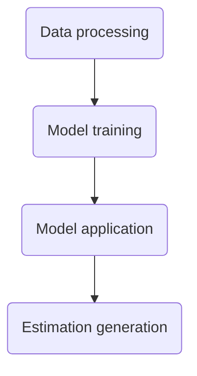
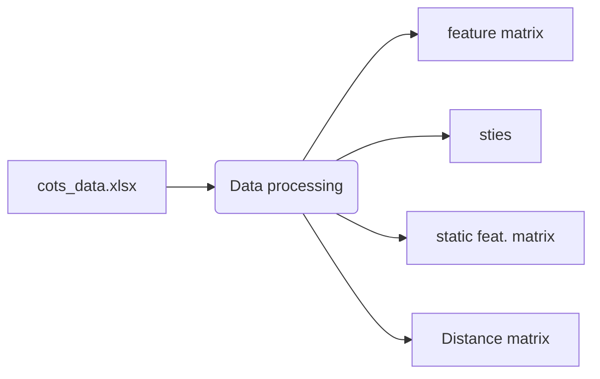
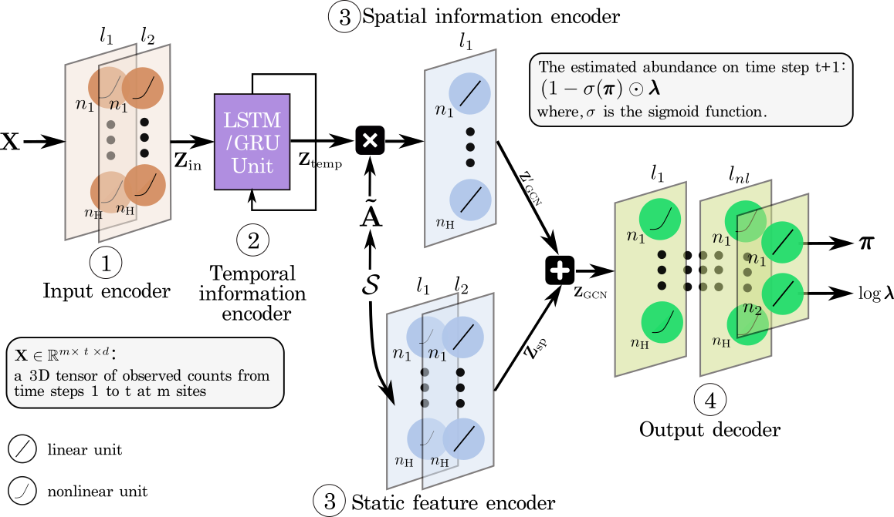
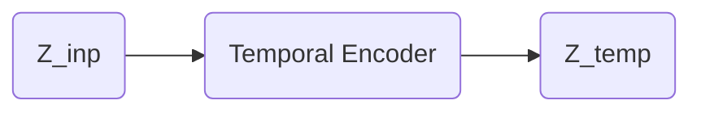
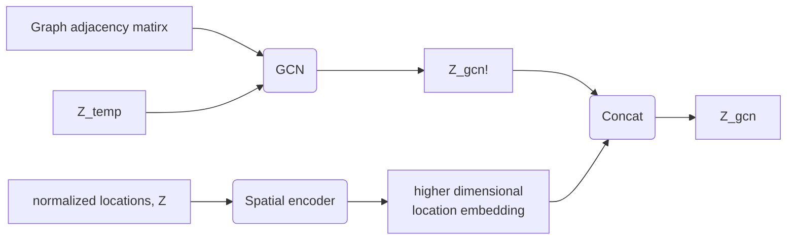
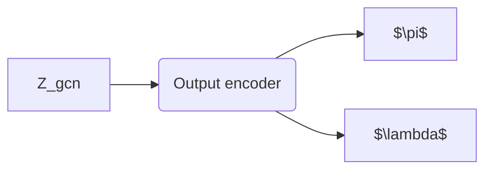

# Leveraging Sparse Observations to Predict Species Abundance Across Space and Time

## Overview

This repository contains the code and annonymized dataset for the article titled “Leveraging Sparse Observations to Predict Species Abundance Across Space and Time.” The project leverages state-of-the-art deep learning techniques to accurately estimate the abundance of COTS from spatiotemporal observations. By utilizing graph convolutional neural networks (GCNs) and recurrent neural netwroks (RNN), our approach aims to provide a robust and efficient method for monitoring COTS populations, which is crucial for coral reef conservation efforts.

## Abstract
Biodiversity is declining globally at an unprecedented rate. Managers urgently need to allocate limited resources to control pest species where interventions have the highest ecological impact. However, many species are hard to detect, and data collection is often expensive, irregular, and incomplete, thus posing significant challenges for machine learning models that traditionally require large and regular datasets. 
We present a novel deep learning architecture that estimates the spatiotemporal abundance of hard-to-detect species from sparse, zero-inflated, and irregular data. 
Our method combines Graph Convolutional Networks (GCNs) to model spatial dependencies across monitoring sites with Recurrent Neural Networks (RNNs) to capture long-range temporal dynamics explicitly addresses the challenges of data sparsity, heterogeneity, and irregular sampling. 
We apply our model to the Crown-of-Thorns Starfish (COTS) on Australia's Great Barrier Reef, a species with devastating impact on coral reefs and a major target of pest control programs. Our method significantly outperforms baseline approaches and the current resource-intensive approach, manta-tow surveillance, in both accuracy and detectability. Simulations indicate a 20\% increase in starfish removal efficiency over a year, enabling more effective coral protection.
This work demonstrates how tailored deep learning methods can overcome ecological data limitations and substantially improve conservation outcomes. 

## Citation
```bibtex
@article{zahid2026stzipn,
  title={Leveraging Sparse Observations to Predict Species Abundance Across Space and Time},
  author={Md Zahidul Islam and Cameron S. Fletcher and Ke Sun and Amir Dezfouli and Iadine Chades,
  year={2026},
  number={TBD},
  journal={Proceedings of the AAAI Conference on Artificial Intelligence},
  year={2026}, 
  month={TBD}, 
  pages={TBD}
}
```

## How to run
Please follow the notebook `driver.ipynb` to run the steps in the code base.

## Main scripts
- **Data Preprocessing**: Scripts for cleaning and preparing data for model training. Code files:
  - `dataprocessing.py`
  - `datautils.py`
- **Model Building**: Scripts to construct various component of our model architecture.
  - `input_encoder.py`
  - `temporal_encoder.py`
  - `spatial_encoder.py`
  - `output_encoder.py`
  - `gcn_encoder.py`
  - `gbrmodel.py`
- **Model Training**: Implementation of our proposed model architecture.
  - `train.py`
  
- **Evaluation**: Tools for assessing model performance.
  - `test.py`


## Repository structure
- `driver.ipynb`
- `readme.md`
- `requirements.txt`
- configs
  - `data_config.py`
  - `model_config.py`
  - `run_config.py`
- data
  - processed-data-pnas
    - `distmat_20240905.npz`
    - `feature_mat_dim_2_norm_False_20240905.npz`
    - `satic_features_20240905.npz`
    - `sites_20240905.npz`
  - rawdata
    - `gbr_cots_culldata.xlsx`
  - `dataprocessing.py`
  - `datautils.py`
- model
  - `baselines.py`
  - `input_encoder.py`
  - `temporal_encoder.py`
  - `spatial_encoder.py`
  - `output_encoder.py`
  - `gcn_encoder.py`
  - `gbrmodel.py`


### Dataset
We removed the location information from the dataset for sharing. The raw dataset has several identifiable information such as:
- **Reef Number**: an identifier to identify a reef on the GBR. We replace the reef number by a generic numbering such as r1, r2,... and so on.
- **Latitude of Site**: the location of the site. We replace the latitudes by random numbers keeping the same number for the same latitude.
- **Longitude of Site**: the location of the site. We replace the longitudes by random numbers keeping the same number for the same longitudes.
- **Site Number**: an identifier to identify a site within a reef. We replace the site number by a generic numbering such as s1, s2,... etc. A generic id r1,s1 refers to some stie 1 on the reef r1.  
- **Date**: the date when a cull action occurred at a specific site. We replace the dates by d1, d2, d3 ..., etc.
- **Voyage Start Date**: the start date of a particualr voyage. We replace the start dates by st1, st2, st3 ..., etc.
- **Voyage Stop Date**: the end date of the voyages. We replace the end dates by en1, en2, en3 ..., etc.

 


## Steps
The basic steps are as follows: 



## Data processing
The data processing layer takes raw input file consisting of COTS cull data and produces several 
files to use in the subsequent layers (or steps). 
- `featurematrix`: a feature matrix of dim (ndays, nsites, fdim) and the targets
- `sites`: a list of sites
- A static feature matrix (normalized site locations)
- A distance matrix between the sites. 



## Model components
In this step we use the files generated by the data processing step to train our model. In this step, we first need to 
set-up our model architecture and then train the model with our input data. 

The train parameters should be defined in `configs/train_params.py`


We have separate files for each module of the model. 
- `input_encoder.py`
- `temporal_encoder.py`
- `gcn_encoder.py`
- `output_encoder.py`
- `spatial_encoder.py`

The whole model is constructed from the modules in `gbrmodel.py`.

### Input encoder
The input encoder is a one-hidden layer network for input representation learning. It takes the feature matrix (**X**) 
as input and generates a higer dimensional represnetation (**H**) of the inputs. The output of the input encoder 
(**H**) is feed to the temporal or spatial encoder based on the desired model architecture.


**Dimensions**:
- Input X: $t \times m \times d$
- Output Z_inp: $m \times t \times h$

$t$ is the number of observed days, $m$ is the number of observed sites and $d$ is the input feature dimension.
 
**Hyper parameters**:
- `h`: the dimension of the hidden layer (or units of the hidden layer).


### Temporal encoder
The temporal encoder is a recurrent network for temporal representation learning. It takes the 
feature encoding of the input encoder (**Z_inp**) as input and generates a temporal encodings of 
the feautres. The output of the temporal encoder (**Z_temp**) is feed to the spatial encoder.



**Dimensions**:
- Input Z_inp: $m \times t \times h$
- Output Z_temp: $m \times t \times h$

**Hyper parameters**:
- `h`: the dimension of the hidden layer (or units of the hidden layer).
- `temporalunit`: lstm or gru 


### Spatial encoder
The spatial encoder includes two sub-modules. A static spatial feautre encoder (implementation is in 
`spatial_encoder.py`). It is two layer Multi Layer Perceptron (MLP) network. The other is a gcn_encoder 
(implementation `gcn_encoder.py`) which is a GCN. 
The spatial encoder takes three inputs - the static spatial feautre encoder takes a vector ($m \times 2$ dimensional) 
of normalized locations. The gcn takes the distance matrix and output of the temporal encoder **Z_temp**. 
The output of the static spatial feautre encoder and gcn are combined and passed through a nonliner function. 
The spatial encoder outputs the spatiotemporal encoding of the inputs as **Z_gcn**.



**Dimensions**:
- Inputs:
  - Z_temp: $m \times t \times h$
  - static_feat: $m \times 2$ 
  - adjacency mat: $m \times m$
- Outputs:
  - Z_gcn!: $m \times t \times h$
  - static_encoding: $m \times 1 \times h$
  - Z_temp: $m \times t \times h$

**Hyper parameters**:
- `h`: the dimension of the hidden layer (or units of the hidden layer).


### Output encoder
The out encoder includes an MLP with multiple layers. The number of layers and number of units 
per layer are hyper-parameters. The implementation of the output encoder is in 
`output_encoder.py`.  
The output encoder takes the spatio temporal feautre encodings and outputs two parameters per site 
corresponding to the zero-inflated Poisson distribution - $\pi$ and $\lambda$. 



**Dimensions**:
- Inputs:
  - Z_{gcn}: $m \times t \times h$  
- Outputs:
  - $\pi$
  - $\lambda$

**Hyper parameters**:
- `h`: the dimension of the hidden layer (or units of the hidden layer).